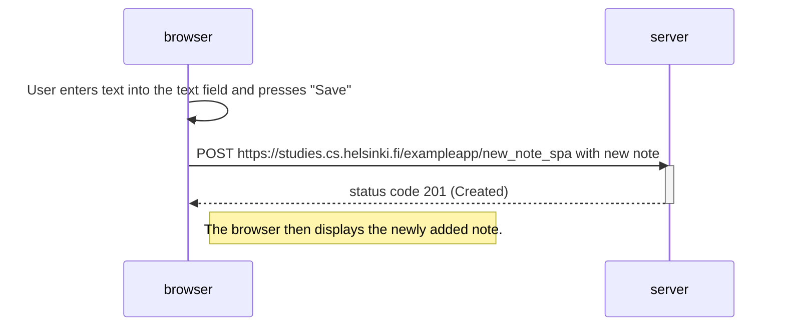

```mermaid
sequenceDiagram
    participant browser
    participant server

    browser->>browser: User enters text into the text field and presses "Save"
    browser->>server: POST https://studies.cs.helsinki.fi/exampleapp/new_note_spa with new note
    activate server
    server-->>browser: status code 201 (Created)
    deactivate server

    Note right of browser: The browser then displays the newly added note.
```